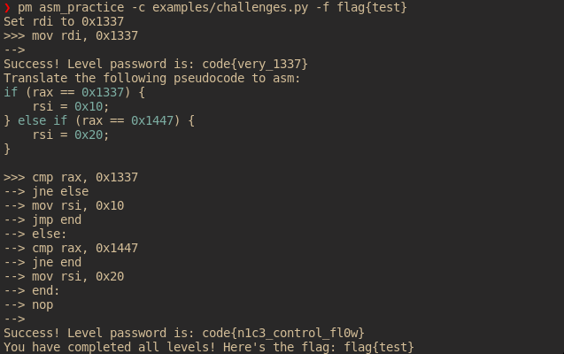

# ASM Practice

A framework for making simple training challenges for assembly programming.

# Deployment

Most likely, you want to use this for a CTF challenge. A demo deployment can be found in the `deploy` directory, all you need to do to run it is have installed:

* Docker engine
* docker-compose

And run `docker-compose up` in the `deploy` directory. You can use the files there as a template. Keep in mind, if you have many players using one source IP (for example, you are on a university campus), you need to increase xinetd's limits.

# Installation

`python3 -m pip install git+ssh://git@github.com/novafacing/asm_practice.git`

Or, you can clone the repository and run it from here.

# What does it do?

What does this do? Probably easiest with an image:

This framework allows you to quickly specify assembly programming environments with one or more starting configurations and end state assertions to test (probably students, but maybe professionals) assembly programming skills.

